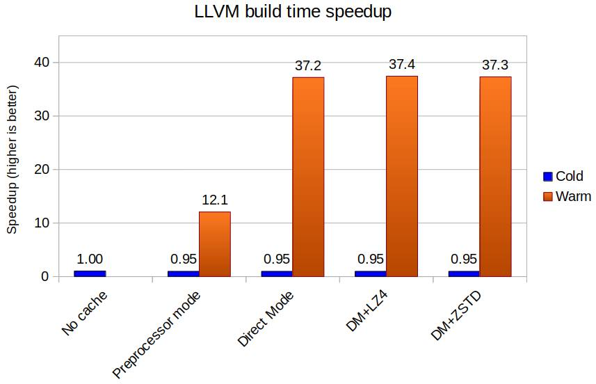

# Benchmarks

## LLVM Compilation

For this benchmark, LLVM *(2021-01-17, Git commit: cfec6cd50c36f3db2fcd4084a8ef4df834a4eb24)* was built from source as follows:

```sh
mkdir build && cd build
cmake -G Ninja -DCMAKE_BUILD_TYPE=Release ../llvm
time ninja
```

The system used for the benchmark was:

* **CPU**: AMD Ryzen 7 1800x (8-core x86-64, underclocked to 3.0 GHz).
* **Disk**: 1TB NVMe (960 EVO)
* **RAM**: 32GiB DDR4 @ 3000 MHz
* **OS**: Linux (Ubuntu 20.04)
* **Compiler**: GCC 9.3.0
* **BuildCache**: 0.24.0

### TL;DR graph



### No cache

| Time | Speed |
|---|---|
| 19m50.9s | 1.0x |

### Local cache, preprocessor mode, no compression

|  | Time | Speed |
|---|---|---|
| Cold cache | 20m55.7s | 0.95x |
| Warm cache | 1m38.7s | 12.1x |

Cache size: **240.8 MiB**

### Local cache, direct mode, no compression

|  | Time | Speed |
|---|---|---|
| Cold cache | 20m56.2s | 0.95x |
| Warm cache | 0m32.0s | 37.2x |

Cache size: **326.7 MiB**

### Local cache, direct mode, LZ4 compression

|  | Time | Speed |
|---|---|---|
| Cold cache | 20m59.0s | 0.95x |
| Warm cache | 0m31.8s | 37.4x |

Cache size: **134.6 MiB**

### Local cache, direct mode, ZSTD compression

|  | Time | Speed |
|---|---|---|
| Cold cache | 20m56.7s | 0.95x |
| Warm cache | 0m31.9s | 37.3x |

Cache size: **86.9 MiB**

### Ccache

For reference, the same compilation was performed with Ccache version 3.7.7 (using the default configuration) on the same system, with the following results:

|  | Time | Speed |
|---|---|---|
| Cold cache | 20m55.7s | 0.95x |
| Warm cache | 0m36.0s | 33.1x |

Cache size: **354.8 MiB**
